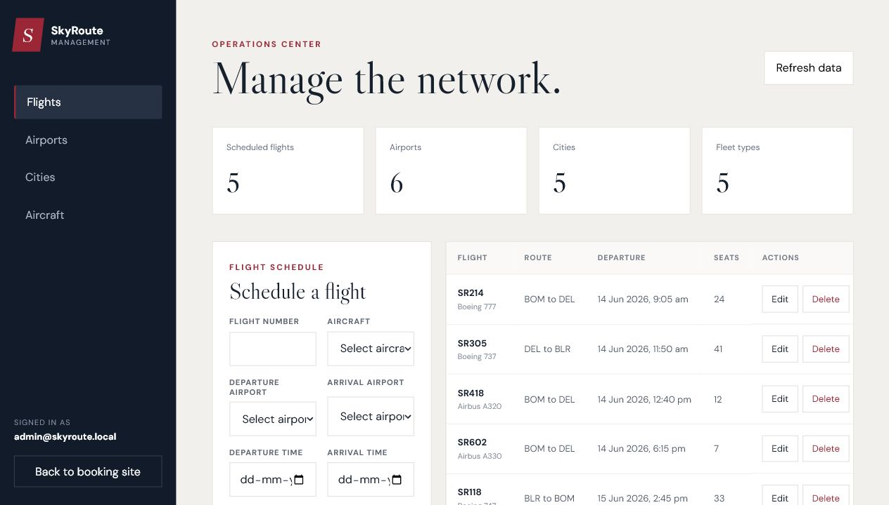

# SkyRoute Airline Platform

SkyRoute is a learning-focused airline platform built as a collection of Node.js
microservices. The backend covers flight inventory, user authentication,
bookings, API routing, and email notification workflows.

The project includes a responsive React web client, stronger validation,
automated tests, and a simplified local development experience.

## Services

| Service | Purpose |
| --- | --- |
| API Gateway | Routes client traffic and protects booking endpoints |
| Auth Service | Handles account creation, sign-in, and token validation |
| Flight Service | Manages cities, airports, aircraft, and flight inventory |
| Booking Service | Creates bookings, updates available seats, and publishes confirmation events |
| Notification Service | Consumes booking events and stores scheduled email notifications |

## Technology

- Node.js and Express
- MySQL and Sequelize
- JSON Web Tokens and bcrypt
- RabbitMQ
- Nodemailer
- React, TypeScript, and Vite

## Web Experience

The traveler-facing frontend includes:

- Responsive flight search with airport and date selection
- Clear flight result cards with duration, fare, seats, and gate information
- Route visualization generated from airport coordinates
- Account creation and token-based sign-in
- Protected booking review and confirmation flow
- Authenticated booking history with status and fare summaries
- Protected management dashboard for cities, airports, aircraft, and flights
- Premium destination, lounge, and cabin-service sections
- Loading, empty, API fallback, and mobile navigation states

When the backend is unavailable, the frontend labels and displays preview data
so the interface remains explorable without presenting it as a live response.

## Screenshots

### Flight Search


### Management Dashboard



## Booking Events

Successful bookings publish persistent confirmation events to a durable
RabbitMQ exchange. The notification service consumes them from a durable queue
and creates pending notification tickets. Broker failures do not roll back a
booking that has already been confirmed.

The scheduled email worker starts when `EMAIL_ID` and `EMAIL_PASS` are
configured. Without those values, notification tickets remain pending and the
service reports email delivery as disabled while continuing to process booking
events normally.

## Local Setup

Requirements:

- Node.js 20 or newer
- MySQL 8
- RabbitMQ

Install all workspace dependencies:

```bash
npm install
```

Start the web client:

```bash
npm run dev:web
```

The frontend uses `http://localhost:4000` by default. Copy
`apps/web/.env.example` to `apps/web/.env` to use another API gateway URL.

Each service includes an `.env.example` file. Copy it to `.env`, update the
database credentials, then create and migrate each database:

```bash
npm run db:create --workspace @skyroute/flight-service
npm run db:migrate --workspace @skyroute/flight-service
```

Use the same commands with the auth, booking, and notification workspace names.

Create an administrator after migrating the auth database:

```bash
set ADMIN_EMAIL=admin@example.com
set ADMIN_PASSWORD=choose-a-strong-password
npm run admin:create
```

In PowerShell, use `$env:ADMIN_EMAIL` and `$env:ADMIN_PASSWORD` instead. Sign in
with that account and select **Manage** in the navigation. The API gateway
verifies the token and administrator role before allowing any inventory write.

The management dashboard includes:

- Network summary counts
- City, airport, and aircraft create/edit/delete workflows
- Flight scheduling and editing
- Responsive tables and validated forms
- Admin-only API mutations derived from the authenticated token

## Containers And Deployment

The repository includes production Dockerfiles, a complete local Compose stack,
database migrations, demo seed data, health checks, Nginx SPA hosting, and CI
container builds.

For the container setup and production environment variables, see
[DEPLOYMENT.md](DEPLOYMENT.md).

## Tests

Run the backend unit tests from the repository root:

```bash
npm test
```

The current suite covers authentication and role sessions, request validation,
flight schedule rules, pagination, API errors, airplane capacity, booking
totals, race-safe seat availability, event publication, and queue consumption.
The repository currently includes 42 passing backend tests.

Portfolio-ready resume bullets are available in
[docs/RESUME_BULLETS.md](docs/RESUME_BULLETS.md).
